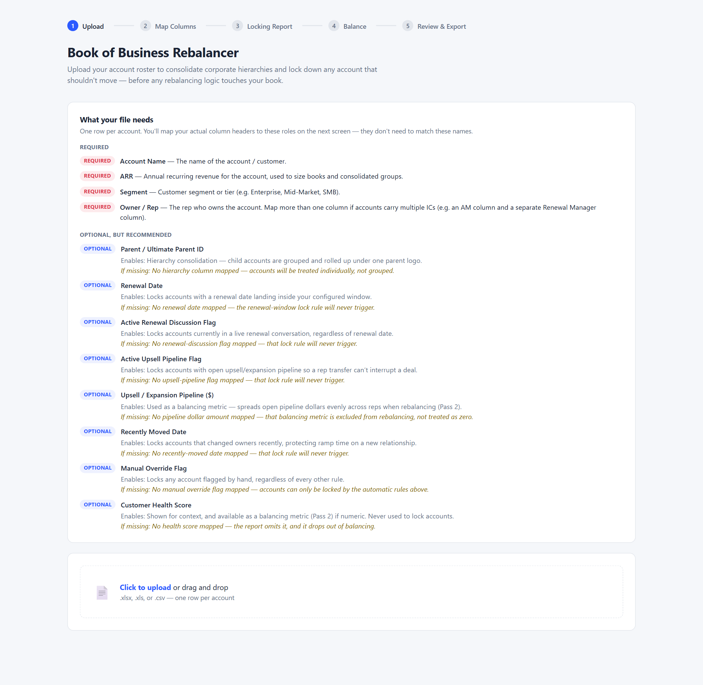
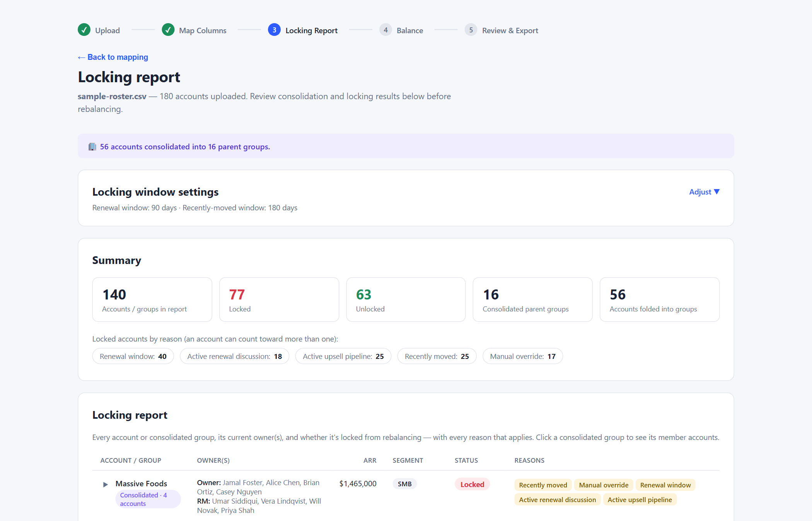
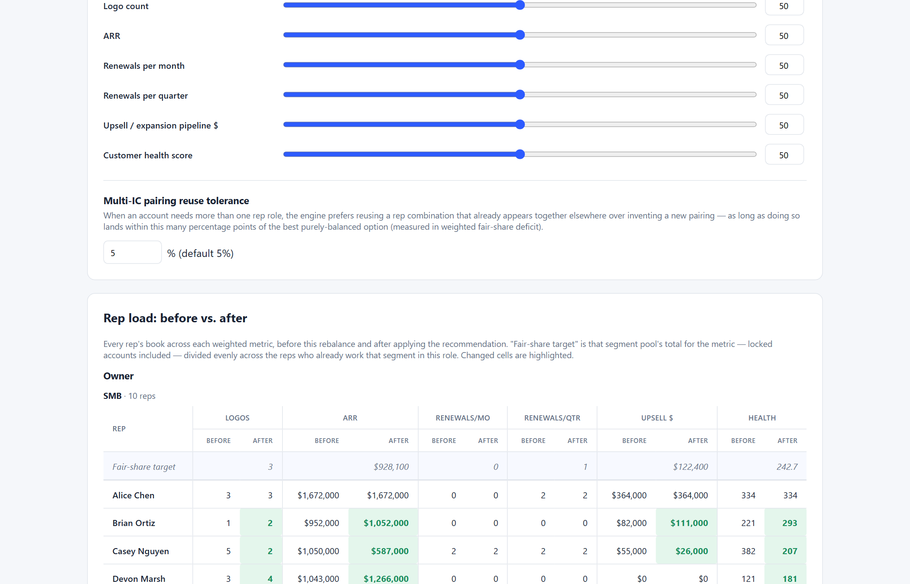
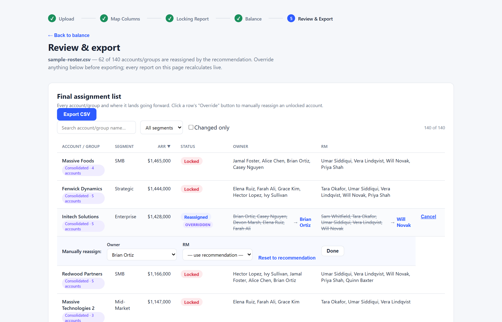
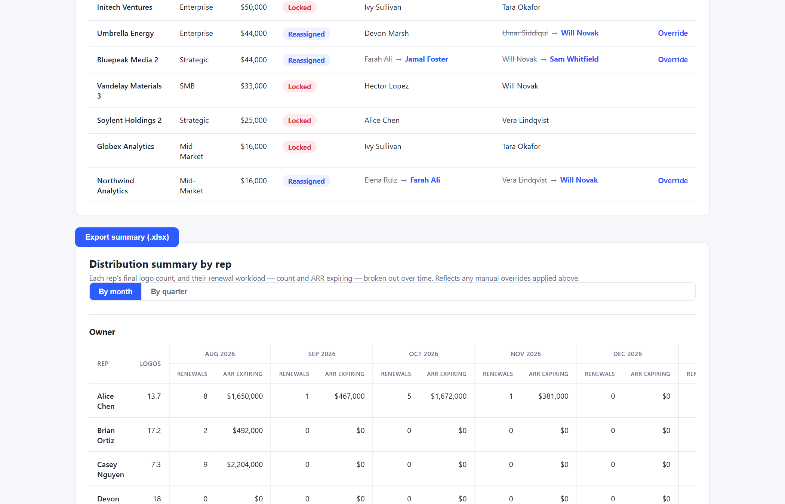
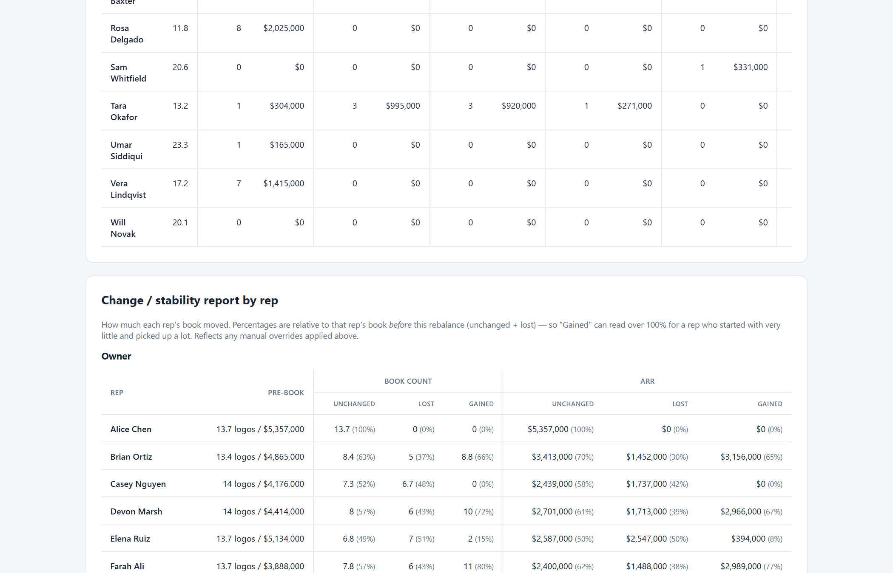

# Book of Business Rebalancer

A single-page tool for account management leaders to rebalance a book of business, end to end:
upload a roster, consolidate corporate hierarchies, lock the accounts that shouldn't move, run a
weighted rebalance on everything that can, then review, manually override, and export the result.

- **Pass 1** — upload, column mapping, corporate hierarchy consolidation, and the locking layer.
  Answers *"which accounts are actually eligible to move?"* and shows its work in a scannable
  report before any rebalancing logic runs.
- **Pass 2** — the weighted rebalancing engine. Decides where the *unlocked* accounts go, and
  minimizes new multi-IC rep pairings while it does. See
  [The balancing methodology, plainly](#the-balancing-methodology-plainly).
- **Pass 3** — the output layer. A sortable, filterable final assignment list with manual
  override, a distribution summary by rep, a change/stability report by rep, and CSV/Excel
  export. See [The final report, plainly](#the-final-report-plainly).

## What this app does

1. **Upload** a CSV or Excel roster, one row per account. A "What your file needs" panel up front
   explains every required and optional column and what mapping it unlocks.

   

2. **Map your columns.** Your headers won't match the app's field names, so you tell it which of
   your columns is the account name, ARR, segment, etc. Owner/rep is a repeatable mapping — map an
   AM column and a separate Renewal Manager column if accounts carry multiple ICs, and they'll all
   show up in the report.
3. **Consolidate corporate hierarchies.** If you map a parent/ultimate-parent column, every child
   account sharing a parent value is grouped into one consolidated unit — one logo, ARR summed
   across the group. A summary line reports how many accounts got folded into how many groups
   (e.g. *"51 accounts consolidated into 16 parent groups"*).
4. **Lock accounts that shouldn't move.** Five rules, each independently toggleable by whether you
   mapped the column it depends on:
   - Renewal date falls within a configurable window of today (default 90 days)
   - Active renewal discussion flag is true
   - Active upsell pipeline flag is true
   - Recently-moved date falls within a configurable window of today (default 180 days)
   - Manual override flag is true

   A consolidated group is locked if **any** member account is locked — the whole logo stays put,
   not just the triggering subsidiary.
5. **Review the locking report** — every account or group, its owner(s), locked/unlocked status,
   and every specific reason it's locked (an account can trigger more than one rule at once).
   Click a consolidated group to expand its member accounts and see which one(s) triggered the
   lock. Summary cards up top show total accounts/groups, locked vs. unlocked, a breakdown of
   locked accounts by reason, and how many accounts were folded into consolidated groups.

   

6. **Rebalance the unlocked accounts.** Set weights across six load metrics, then the engine
   assigns every unlocked account/group to whoever in its segment is furthest below fair share —
   while trying not to invent new rep-pairings when an existing one will do.

   

7. **Review, override, and export.** A final assignment list shows every account/group and where
   it lands, with from → to for anything that moved; click any unlocked, reassigned account to
   manually force it to a different rep, and every report below recalculates live. A distribution
   summary and a change/stability report break the final book down by rep. Export the assignment
   list as CSV and the summary tables as a multi-sheet Excel workbook.

Locked accounts never move, in any pass — Pass 2 only decides where the *unlocked* ones land, and
Pass 3 lets you review and adjust that decision before it's final.

## File format

One row per account. Column headers can be anything — you map them to these roles on screen 2.

**Required:**

| Role | What it is |
|---|---|
| Account Name | The name of the account/customer |
| ARR | Annual recurring revenue |
| Segment | Customer segment or tier (e.g. Enterprise, SMB) |
| Owner / Rep | The rep who owns the account. Map more than one column for multi-IC accounts (e.g. AM + Renewal Manager) |

**Optional, but recommended:**

| Role | Enables | If missing |
|---|---|---|
| Parent / Ultimate Parent ID | Hierarchy consolidation — child accounts grouped under one parent logo | Accounts are treated individually, not grouped |
| Renewal Date | Locks accounts with a renewal inside the configured window; feeds the renewals/month and renewals/quarter balancing metrics, and the distribution summary's renewal workload columns | Those lock, balancing, and reporting features never trigger |
| Active Renewal Discussion Flag | Locks accounts in a live renewal conversation | That lock rule never triggers |
| Active Upsell Pipeline Flag | Locks accounts with open upsell/expansion pipeline | That lock rule never triggers |
| Upsell / Expansion Pipeline ($) | A dollar figure used as a balancing metric — separate from the flag above, which is boolean | That balancing metric is excluded, not treated as zero |
| Recently Moved Date | Locks accounts that changed owners recently | That lock rule never triggers |
| Manual Override Flag | Locks any account flagged by hand, regardless of other rules | Accounts can only be locked by the automatic rules |
| Customer Health Score | Shown for context; used as a balancing metric if numeric | Report omits it, and it drops out of balancing |

Flag columns accept common truthy/falsy spellings (`TRUE`/`FALSE`, `Yes`/`No`, `Y`/`N`, `1`/`0`).
Dates accept Excel date cells or common string formats (`MM/DD/YYYY`, ISO, etc.).

## Locking rule details

- **Renewal window** — locked if the renewal date is within `renewalWindowDays` of today in
  either direction (covers an upcoming renewal *and* a recently-passed one that hasn't been
  closed out yet).
- **Recently moved** — locked if the recently-moved date is between 0 and
  `recentlyMovedWindowDays` days in the past. A future-dated "move" is ignored.
- Both window lengths are adjustable from the Locking Report screen and recompute the report live.

## Corporate hierarchy consolidation

If a parent/ultimate-parent column is mapped, rows sharing the same (case-insensitive) parent
value are grouped into one consolidated unit. A parent value referenced by only one row doesn't
merge with anything and stays a standalone account. If a row's own account name matches the
parent value (i.e. the parent company has its own row in the file), that row's name becomes the
group's display name; otherwise the group is labeled with the raw parent value.

## The balancing methodology, plainly

Pass 2 is a **heuristic**, not a solver. It makes one reasonable greedy pass through the unlocked
accounts and assigns each one to whoever needs it most *at that moment*. It does not explore
alternative orderings, backtrack, or guarantee the lowest possible imbalance — a banner on the
Balance screen says so, and it's worth repeating here: **review the recommendation before
finalizing it.**

### The six load metrics

Every rep's "load" is measured across up to six metrics, each independently weighted:

| Metric | How a group contributes | Requires |
|---|---|---|
| Logo count | 1 per consolidated group (a 5-account logo is still 1 logo) | Always available |
| ARR | The group's summed ARR | Always available |
| Renewals per month | Count of member accounts with a renewal date in the next 30 days | Renewal Date mapped |
| Renewals per quarter | Count of member accounts with a renewal date in the next 90 days | Renewal Date mapped |
| Upsell/expansion pipeline $ | Sum of member accounts' pipeline dollar values | Upsell Pipeline ($) mapped |
| Customer health score | Sum of member accounts' numeric health scores | Health Score mapped and numeric |

**A metric with no source column is excluded from weighting entirely — never silently treated as
zero.** The weight sliders for unavailable metrics are grayed out in the UI, and the remaining
weights are renormalized across whatever *is* available.

Health score is **summed**, like every other metric, rather than averaged. That's a deliberate
simplification: averaging would require tracking a running mean as accounts get assigned, which
doesn't compose cleanly with the additive fair-share math the other five metrics use. In practice
it means a rep's total health-score weight roughly tracks book size as well as book quality — see
[What this produces — and does not](#what-this-produces--and-does-not).

Renewals/month and renewals/quarter use fixed 30- and 90-day rolling windows from today — a
literal calendar month and quarter — independent of the Pass 1 locking windows, which are a
separate, user-adjustable setting.

### Fair share and "load"

Balancing runs **separately for every (segment, rep role) pool** — Enterprise AMs are only
compared against other Enterprise AMs, never against SMB AMs or against Renewal Managers. For
each pool:

- **Pool total** for a metric = that metric summed across *every* account/group in the segment,
  locked and unlocked alike. Locked ARR still exists; it's just not movable.
- **Fair-share target** = pool total ÷ number of reps currently working that segment in that
  role. Reps aren't invented — the pool is exactly the reps who already own at least one account
  there today.
- **Current load** starts from each rep's **locked** accounts only. A rep's *before* total (shown
  in the results table) additionally includes their current unlocked accounts, since that's what
  their book actually looks like today, before the shuffle — but the simulation itself only seeds
  from what can't move, then builds up the after-state by assigning the unlocked accounts one at a
  time.
- Load is attributed **per account, not per consolidated group**, with each member's logo credit
  split fractionally across its group (a 4-account group split across 2 different current owners
  credits each owner 0.5 logos). This matters because a messy consolidated group can easily have
  inconsistent legacy ownership across its members — crediting the group's *full* total to every
  such owner would double- or triple-count it. Per-account attribution keeps every pool's before
  and after totals mathematically conserved: they always sum back to the pool total, exactly.

### The greedy assignment

1. Within each segment, unlocked groups are processed **largest ARR first** — ARR is used as the
   proxy for "logo-impact" so one early, oddly-sized assignment doesn't distort everything that
   follows.
2. For each group and each rep role it needs, every candidate rep gets a **weighted deficit
   score**: for each available metric, `(target − current) ÷ target`, weighted and summed. A
   positive score means "below fair share"; the rep with the highest score is furthest behind.
3. The group is assigned to the top-scoring rep for each role, loads are updated, and the process
   repeats for the next group. This is the entire algorithm — no lookahead, no swapping earlier
   assignments once made.

### Multi-IC pairing minimization

When a group needs two or more rep roles at once (an AM *and* a Renewal Manager, say), picking
each role's single best rep independently can mint a brand-new pairing every time, even when an
existing pairing would have worked almost as well. Instead:

1. For each role, the top few candidates (by deficit score) are shortlisted.
2. Every combination across those shortlists is scored as the sum of its members' individual
   deficit scores — the highest-scoring combination is the "pure balance" choice.
3. If any shortlisted combination is a pairing that **already exists** elsewhere in the segment
   (seeded from the roster as uploaded, and updated as the run proceeds) and its score is within
   the configured tolerance (default 5 percentage points of weighted deficit score) of the pure
   balance choice, that reused combination is assigned instead.

This is a bounded, greedy search over a handful of shortlisted reps per role — not an exhaustive
search over every possible pairing — so it stays fast regardless of roster size.

### Results

The Balance screen shows, for every (role, segment) pool: each rep's fair-share target and their
before/after totals across every weighted metric, with changed cells highlighted. Below that, a
pairing summary counts distinct rep-pairings before vs. after the run, plus how many
reassignments reused an existing pairing vs. created a new one. An assignment-detail table lists
every unlocked account/group in the order it was processed and exactly who it landed on — the
whole recommendation is inspectable, not a black box.

### What this produces — and does not

**This is a fast, transparent recommendation for a first-pass rebalance — not an optimal
solution, and not a substitute for a human reviewing the result.** Concretely:

- It is a **greedy heuristic**, not a solver. Processing groups in a different order, or making a
  locally-worse assignment early on, can sometimes produce a *more* balanced final result than
  always taking the locally-best option — a greedy pass can't see that. It does not backtrack.
- **Fair share is equal division**, not capacity-weighted. A rep pool's target assumes every rep
  in it should end up with roughly the same load, with no way to tell the app "this rep has more
  bandwidth than that one."
- **Health score is summed, not averaged** (see above) — it nudges toward balanced *total* health
  points, which correlates with but isn't identical to balanced *average* portfolio health.
  A rep with a small number of very high- or very low-health accounts can look more or less
  balanced on this metric than their average portfolio quality would suggest.
- **Renewals/month and renewals/quarter are rolling windows from today**, not a true recurring
  cadence — re-running the tool next month will naturally shift which accounts count toward those
  two metrics.
- **A consolidated group with inconsistent legacy ownership is deliberately "split"** in the
  before-state (fractional logo credit per current owner) so the numbers stay conservative and
  auditable — but that means no single rep is shown as the group's sole "current" owner if the
  data itself doesn't agree on one.
- It does **not** account for rep tenure, ramp time on newly-assigned (as opposed to
  newly-*moved*) accounts, geography, language, vertical specialization, or anything else not
  present in the uploaded columns.

Use it to generate a strong starting point and see the tradeoffs it made, not as an
auto-finalized headcount decision. That review step is exactly what Pass 3 is for.

## The final report, plainly

Pass 3 turns Pass 2's recommendation into three views of the *final* state — the recommendation
with any manual overrides applied — plus export. All three recalculate live as you override
individual accounts, because they're all derived from the same underlying rule:

> **A group's final owner for a role** is your override, if you set one; otherwise the algorithm's
> assignment, if it made one; otherwise whoever already owns each of that group's member accounts
> today (which is always the case for locked groups, since they never got an assignment in the
> first place). That fallback is what lets locked and unlocked groups, and overridden and
> non-overridden ones, all flow through the exact same reporting code.

### Final assignment list



Every account/group, one row each, sortable by name/segment/ARR/status and filterable by segment,
name search, or a "changed only" checkbox. A locked row is always "Locked" and never editable — a
core guarantee carried over from Pass 1. An unlocked row that the algorithm actually processed
(i.e. it had at least one candidate rep in its segment) shows an **Override** button: click it to
pick a different rep per role from every rep who holds that role anywhere in the roster — not just
the algorithm's own shortlist, so you're never blocked from a legitimate call the heuristic didn't
consider. An overridden row is tagged, and a "Reset to recommendation" link clears it.

### Distribution summary by rep



For each rep (grouped by role, since an AM's book and a Renewal Manager's book are different
things), their final logo count and a forward-looking renewal workload: count of renewals and ARR
expiring, bucketed across the next 12 months or the next 4 quarters (toggle between the two).
Every account's renewal contributes only to the single bucket its renewal date actually falls in
— this is a true calendar breakdown, not the rolling 30/90-day windows Pass 2 uses for balancing.

### Change / stability report by rep



For each rep, how much of their book is unchanged vs. lost vs. gained, as both a count and an ARR
figure, each also expressed as a percentage. **All three percentages share one denominator: that
rep's book *before* this rebalance** (unchanged + lost). That's a deliberate choice — a single
consistent baseline is easier to reason about than switching denominators mid-table — and it means
"gained %" can read over 100% for a rep who started with very little and picked up a lot; that's a
real signal about disruption, not a display bug. Locked accounts always land in "unchanged," for
whoever already owns them, since nothing about this tool ever touches them.

Gained/lost/unchanged are computed **per member account**, with logo credit split fractionally
across a group the same way Pass 2 splits load — so a 5-account group that moves from three
different legacy owners to one new owner registers as a loss for each of the three (proportional
to how many of the group's accounts they held) and a full gain for the new owner, not an
all-or-nothing flip.

### Export

- **Final assignment list → CSV.** One row per account/group, with a From/To column pair per rep
  role, ready to paste into a CRM bulk-update template.
- **Summary tables → one Excel workbook**, three sheets: `Distribution - Monthly`,
  `Distribution - Quarterly`, and `Change & Stability`. A true multi-sheet `.xlsx` (via SheetJS),
  not three separate CSVs, since the summary tables are meant to be read together.

Both exports reflect whatever overrides are active at the moment you click export.

## Running locally

Requires [Node.js](https://nodejs.org/) 18+ and npm.

```bash
npm install
npm run dev
```

This starts a Vite dev server (default `http://localhost:5174`) and opens it in your browser.

To build a static production bundle:

```bash
npm run build
npm run preview   # serve the built output locally
```

## Sample data

Two sample files are included. `sample-roster.csv` is a large, realistic-looking roster; if
you'd rather work from a smaller file where every test case is individually labeled and easy to
verify by eye, use `sample-roster-v2.csv` instead (see
[Targeted test file: `sample-roster-v2.csv`](#targeted-test-file-sample-roster-v2csv) below).

### `sample-roster.csv` — the large, realistic roster

[`samples/sample-roster.csv`](samples/sample-roster.csv) has 180 rows built to exercise every
branch of all three passes:

- 4 segments (Enterprise, Mid-Market, SMB, Strategic)
- 16 parent/child hierarchy groups of varying size (2–5 accounts each), some with the parent's
  own row present (tests display-name resolution) and some without (tests the fallback label) —
  and, since reps are assigned per-row independent of grouping, several of these groups carry
  inconsistent legacy ownership across members, exercising the fractional logo-credit path in both
  the balancing engine and the final report
- Two rep columns (`Account Manager`, `Renewal Manager`) simulating a multi-IC book, with enough
  overlap in who's paired with whom that pairing-reuse has real opportunities to kick in
- A mix of accounts hitting every lock reason individually, several hitting two or three reasons
  at once (to check the multi-reason display), and a healthy share hitting none (to check the
  unlocked path)
- A numeric `Upsell Pipeline ($)` column distinct from the boolean `Upsell Opportunity Open?`
  flag, and a numeric `Health Score (0-100)` column, so every balancing metric has real data
- Renewal dates spread across the next several months and quarters, so the distribution summary's
  time-bucketed columns have real variation to show

## Targeted test file: `sample-roster-v2.csv`

[`samples/sample-roster-v2.csv`](samples/sample-roster-v2.csv) is a smaller, **deliberately
hand-designed** 82-row roster — every account exists to cover one specific, named test case rather
than to look like a plausible real book. Use it when you want to verify one piece of behavior at a
time instead of reading results out of 180 realistic-but-noisy rows. Regenerate it with:

```bash
npm run sample:generate-v2
```

(`scripts/generate-sample-roster-v2.mjs` — deterministic, same output every run.) It maps the same
way as the other sample: `Account Manager` → an Owner rep column, `Renewal Manager` → a second rep
column, everything else by name.

Three segments (Enterprise, Mid-Market, SMB), each with its own **exclusive** 4-rep pool — 2 AMs
and 2 Renewal Managers who appear in that segment only, so a segment's "before" and "after" totals
in the Balance screen are simple to eyeball without cross-segment noise:

| Segment | AMs | Renewal Managers |
|---|---|---|
| Enterprise | Nora Ellis, Marcus Webb | Priya Anand, Derek Shaw |
| Mid-Market | Yuki Tanaka, Beatriz Solis | Fatima Noor, Liam Brooks |
| SMB | Owen Clark, Sara Kim | Tomas Reyes, Ingrid Palmer |

What each case covers, and what to expect when you run it through the app:

| # | Case | Where it lives | What to check |
|---|------|-----------------|---------------|
| 1 | Three segments with fully separate rep pools | All rows | The Balance and Final Report screens never mix a rep into another segment's table |
| 2 | Hierarchy groups of varying size, including a 2-child group | `Anchor Systems` (2 children, no parent row), `Cobalt Partners` (2 children, no parent row), `Beacon Analytics` (parent row + 3 children) | Locking report shows 4 consolidated groups of sizes 6/4/2/2; `Anchor Systems` and `Cobalt Partners` display their parent-ID string as the group name (fallback label path), `Beacon Analytics` and `Vertex Holdings` use the parent row's own name |
| 3 | 5+-child hierarchy group | `Vertex Holdings` (1 parent row + 5 children = 6 members) | Locking report's largest consolidated group |
| 4 | **Regression case** — inconsistent legacy ownership within one hierarchy group | `Vertex Holdings` — its 6 members carry 2 different AMs and 2 different RMs before consolidation | Locking report's Owner/RM columns for this group show multiple comma-joined names (not one clean owner); on the Balance screen this group's "before" load is exactly what previously got double-counted — conservation still holds (every segment/role pool's before and after totals sum to that pool's total, exactly) |
| 5 | Every individual lock reason, ≥2 times each | 14 locked standalone accounts (see script comments for the full list) | Locking report's reason-count chips each read 3 or 4, never 0 or 1 |
| 6 | Multiple overlapping lock reasons on one account | `Orbit Holdings` (renewal window + upsell), `Pinnacle Systems` (discussion + recently moved), `Quarrystone Group` (override + upsell) | Each shows 2 reason badges, not 1 |
| 7 | No hierarchy at all | Every locked account and every flexible account (68 of 82 rows) | Confirms the no-parent-column path still works correctly alongside consolidation |
| 8 | Volume of flexible, fully unlocked accounts per segment | 18 standalone unlocked accounts per segment (54 total), renewal dates (where set) always 100+ days out so they can't accidentally lock | Balance screen has enough movable accounts per segment pool for the fair-share math to mean something, not just 2–3 trivial reassignments |
| 9 | Missing optional values | ~13% of rows have a blank Health Score; most rows have a blank Upsell Pipeline ($) | Upload and mapping succeed with no errors; the health-score weight slider still works using only the rows that have a number; blank cells never render as `$0` or `0` in the report |
| 10 | Deliberate starting imbalance, easy to eyeball | Every Enterprise locked account is owned by Nora Ellis, and flexible Enterprise accounts skew ~78/22 to Nora Ellis over Marcus Webb | Before rebalancing, Nora's current book is **~3.1x** Marcus's (~$3.51M vs ~$1.12M — printed by the generator script on every run as a sanity check). After rebalancing (default equal weights), the two should land close to the $2.32M fair-share target, a dramatic and obvious swing in the before/after ARR columns |
| 11 | Multi-IC pairing reuse, testable at volume | Only 4 possible (AM, RM) combinations exist per segment (2 AMs × 2 RMs), and every combination already appears in the roster as uploaded | Every one of the 58 unlocked multi-role reassignments reuses an existing pairing — the Balance screen's pairing summary reads 0 new pairings, and several individual pairings (e.g. `Marcus Webb` + `Priya Anand`) get reused by a dozen or more accounts each |

## Tech

- [React](https://react.dev/) + [Vite](https://vitejs.dev/)
- [SheetJS (`xlsx`)](https://sheetjs.com/) for parsing `.xlsx`/`.xls`/`.csv` uploads, the final
  assignment list's CSV export, and the multi-sheet Excel summary export
- No backend — all parsing, consolidation, locking, balancing, and reporting logic runs
  client-side in the browser; uploaded files never leave your machine.
